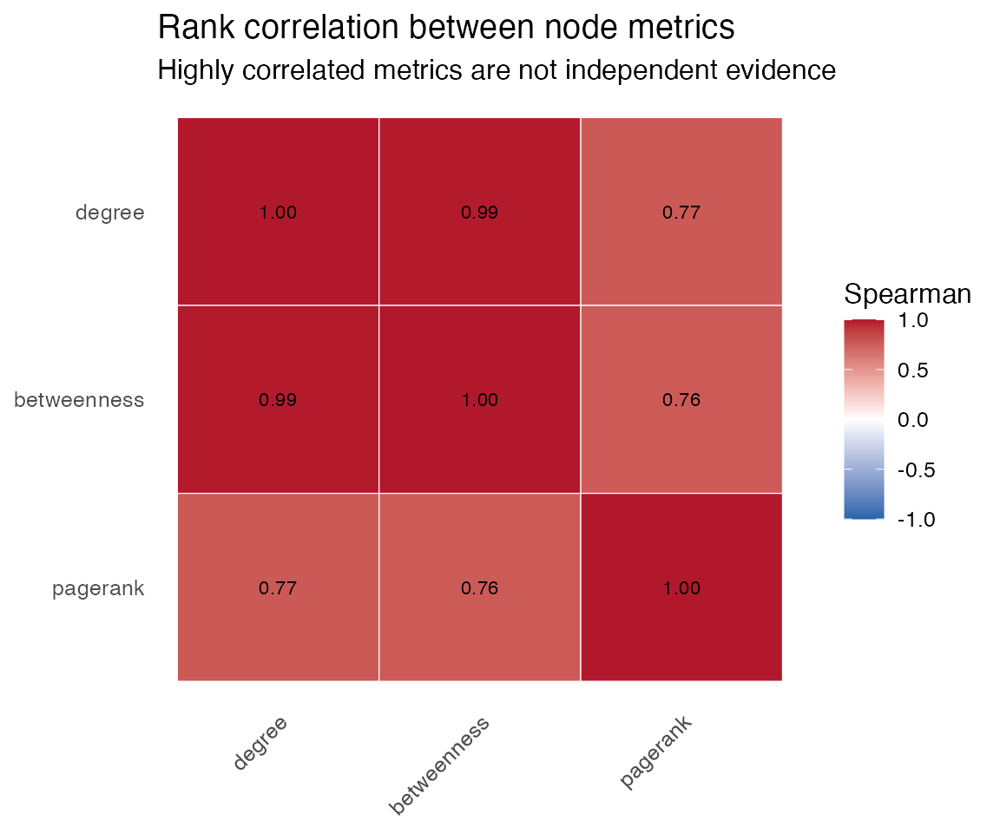
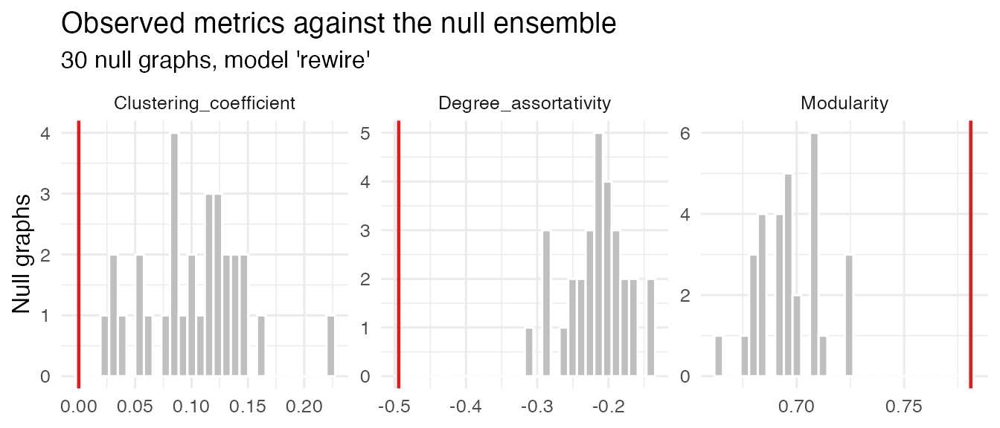
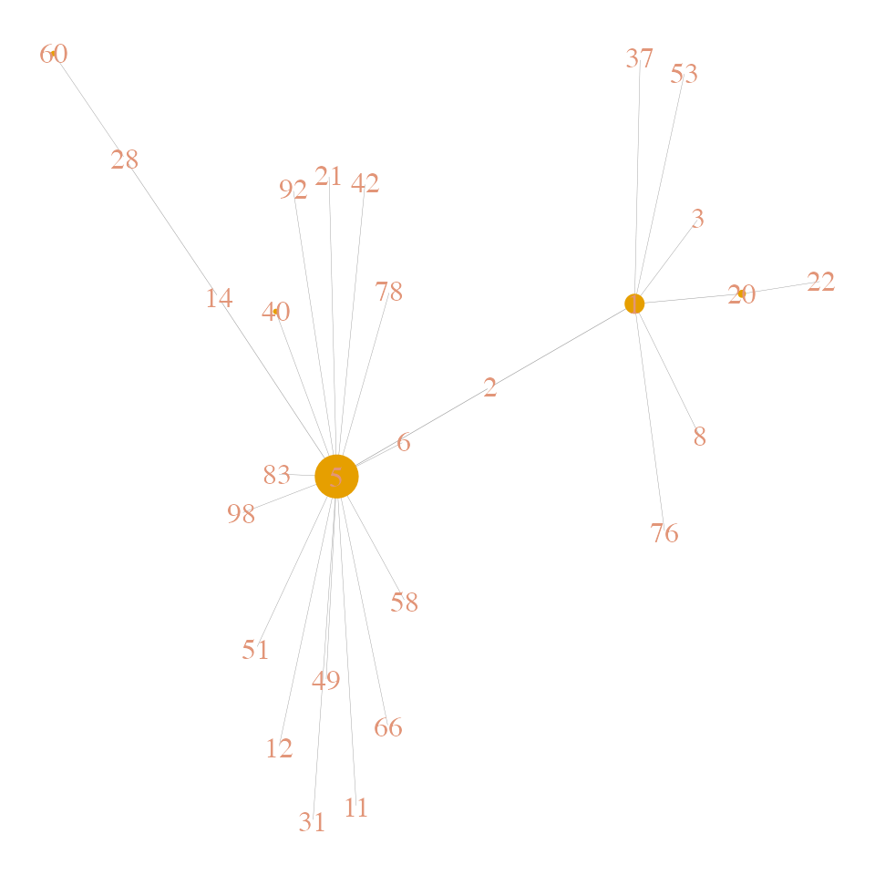
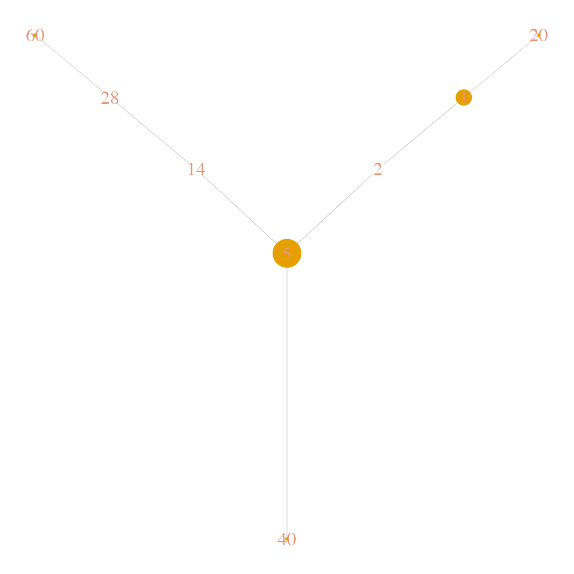

# Introduction to netkit

**netkit** is a lightweight, modular R package designed to simplify the
analysis and visualization of complex networks, particularly in
biological contexts such as protein–protein interactions, gene
co-expression, and signaling networks. However, provided functions and
analyses can theoretically be applied to any kind of interaction
network. It provides a user-friendly interface to explore network
topology, visualize annotated graphs, simulate signal diffusion, and
evaluate network robustness.

Key use cases include:

- Mapping metadata onto networks

- Identifying hubs, bottlenecks, and communities

- Simulating information flow within a network

- Prioritizing seed nodes for targeted interventions

- Visualizing networks with meaningful node/edge annotations

With a special scope to generate high-quality and interpretable figures
suitable for publication, most of the functions generate both tabular
results and diagnostic plots. The package also offers flexible network
visualization options that support node/edge metadata mapping, dynamic
sizing, and layout control.

The toolkit is built on `igraph`, but adds streamlined, high-level
functionality to perform common network analysis tasks with minimal
friction. All diagnostic plots are built on `ggplot2`, allowing for
flexible customization.

## 0. Installation

**netkit** can be installed from github, as follows:

    # If not already installed:
    install.packages("devtools")

    # Install netkit from GitHub
    devtools::install_github("agallinat/netkit")

``` r

# Load netkit
library(netkit)
```

## 1. Annotate Graphs

For this tutorial we will use two different synthetic graphs generated
using
[`igraph::sample_pa()`](https://r.igraph.org/reference/sample_pa.html)
and
[`igraph::sample_gnp()`](https://r.igraph.org/reference/sample_gnp.html)
functions. We also generate two `data.frame` objects containing
simulated nodes’ and edges’ metadata to be included in the original
graph.

``` r

suppressMessages(library(igraph))

set.seed(123)

# Generate synthetic graphs
g <- sample_pa(100, power = 1.5, directed = F)
V(g)$name <- as.character(1:vcount(g))

g2 <- sample_gnp(100, 0.02, directed = T)
V(g2)$name <- as.character(1:vcount(g2))

# Simulate nodes and edges metadata
nodes_info <- data.frame(node = V(g)$name, 
                         category = sample(LETTERS, vcount(g), replace = T),
                         score = rnorm(vcount(g)))

edges <- as_edgelist(g)
edges_info <- data.frame(from = edges[,1], to = edges[,2], edge_score = rnorm(ecount(g)))
```

For instance, this simulated metadata could represent gene expression
results, entity types, edge confidence scores, effect of the
interaction, or any type of information, that may be useful to include
as an `igraph` object. We can annotate an existing graph, using the
[`assign_attributes()`](https://agallinat.github.io/netkit/reference/assign_attributes.md)
function. Only matching nodes and edges are updated. Warnings are issued
when there are unmatched entries.

``` r

library(netkit)

# Add metadata to an existing graph
g <- assign_attributes(g, nodes_table = nodes_info, edge_table = edges_info)

vertex_attr_names(g)
#> [1] "name"     "category" "score"
edge_attr_names(g)
#> [1] "edge_score"
```

## 2. Network Visualization

[`plot_Net()`](https://agallinat.github.io/netkit/reference/plot_Net.md)
is the main visualization function. It supports size/color mapping of
nodes and edges using existing nodes’ metadata. It also allows layout
control.

``` r

# In the default plot, nodes' size is mapped to degree and edges' width to betweenness
plot_Net(g)
```


``` r


# Nodes size and edge with scalling factors can be modified at will. 
plot_Net(g, edge.width.factor = 0.3, node.size.factor = 2)
```


``` r


# And turned off
plot_Net(g, node.degree.map = F, edge.bw.map = F)
```


``` r


# Node colors can be mapped to existing nodes metadata
plot_Net(g, color = "score", node.degree.map = F)
```


``` r


# For directed graphs, arrow sizes are also easily custimizable
plot_Net(g2, edge.width.factor = 0.5, node.size.factor = 2, edge.arrow.size = 0.3)
```


Specific nodes can also be highlighted using the function
[`highlight_nodes()`](https://agallinat.github.io/netkit/reference/highlight_nodes.md)
and the nodes’ name. Highlighting method (label, fill and/or outline)
and colors can be customized at will. Additional arguments are passed to
the
[`plot_Net()`](https://agallinat.github.io/netkit/reference/plot_Net.md)
function:

``` r

highlight_nodes(g, nodes = c("1", "2", "4"), method = c("outline", "fill"),
                edge.width.factor = 0.3, node.degree.map = FALSE)
```


Both functions
([`plot_Net()`](https://agallinat.github.io/netkit/reference/plot_Net.md)
and
[`highlight_nodes()`](https://agallinat.github.io/netkit/reference/highlight_nodes.md))
also allow for layout control via `layout` parameter. This accepts a
coordinates matrix custom or generated by any of the layout functions
available in `igraph` package. A special layout option has been
implemented in `netkit` package to display the network as a horizontal
tree
([`layout_horizontal_tree()`](https://agallinat.github.io/netkit/reference/layout_horizontal_tree.md)).
Which is particularly useful to show hierarchical relationships.

``` r

plot_Net(g, edge.width.factor = 0.3, node.size.factor = 2,
         layout = layout_horizontal_tree(g))
```


### 3. Topological Analysis

### 3.1. Global topology

The core functions for a global network topology analysis are
[`plot_CCDF()`](https://agallinat.github.io/netkit/reference/plot_CCDF.md),
which generates a plot of the **complementary cumulative degree
distribution (CCDF)**, and
[`summarize_graph_metrics()`](https://agallinat.github.io/netkit/reference/summarize_graph_metrics.md),
which calculates the following parameters for an input graph:

- Number of nodes and edges
- Directed `TRUE/FALSE`
- Graph density
- Diameter and average path length of the largest connected component
- Clustering coefficient (transitivity)
- Degree assortativity
- Average degree and betweenness centrality
- Number of connected components and size of the largest connected
  component
- Number of single nodes
- Algebraic connectivity (second-smallest Laplacian eigenvalue)
- Degree entropy (Shannon entropy of the degree distribution)
- Gini coefficient of node degrees
- Modularity of the community structure (via Louvain algorithm)

The function
[`compare_networks()`](https://agallinat.github.io/netkit/reference/compare_networks.md),
accepts two graphs as input, and computes the same metrics on both, and
their associated (CCDF).

``` r

# Global topology analysis
summarize_graph_metrics(g)
#>   Nodes Edges Is_directed Is_weighted Density Diameter Average_path_length
#> 1   100    99       FALSE       FALSE    0.02       10            5.027273
#>   Clustering_coefficient Degree_assortativity Avg_degree Avg_strength
#> 1                      0           -0.4943885       1.98         1.98
#>   Avg_betweenness Components Single_nodes LCC_size LCC_percent
#> 1          199.35          1            0      100           1
#>   Algebraic_connectivity Degree_entropy Gini_degree Modularity
#> 1             0.01500655       1.504678   0.4341414  0.7809917

# Complementary cumulative degree distribution
# It optionally shows a power law reference distribution of chosen gamma.
plot_CCDF(g, show_PL = TRUE, PL_exponents = c(1.5))
```


``` r


# Same analyses to compare two networks
compare_networks(g, g2)
#> <netkit result: compare_networks()>
#> $plot             <ggplot> print(x$plot) to draw
#> $global_topology  <data.frame> 2 x 20 | Nodes, Edges, Is_directed, Is_weighted, Densi...
#> $similarity       <data.frame> 1 x 3 | jaccard_similarity, node_overlap, edge_overlap
#> $ks_test          <ks.test [6]> statistic, p.value, alternative, method, data...
```

### 3.2. Node-level metrics

While
[`summarize_graph_metrics()`](https://agallinat.github.io/netkit/reference/summarize_graph_metrics.md)
describes the graph as a whole,
[`node_metrics()`](https://agallinat.github.io/netkit/reference/node_metrics.md)
describes its vertices: it computes degree, strength, betweenness,
harmonic centrality, eigenvector centrality, PageRank, coreness, local
clustering, Burt’s constraint and eccentricity in a single call, and
attaches each one to the graph as a vertex attribute.

That last part is what makes it chain. Any netkit function that accepts
a numeric vertex attribute — `plot_Net(color = )`,
`robustness_analysis(removal_strategy = )` — can use the results
directly.

``` r

nm <- node_metrics(g, plot = FALSE)

head(nm$result)
#> # A tibble: 6 × 11
#>   node  degree strength betweenness harmonic eigenvector pagerank coreness
#>   <chr>  <dbl>    <dbl>       <dbl>    <dbl>       <dbl>    <dbl>    <dbl>
#> 1 1     0.0707        7      0.662     0.376      0.152   0.0301         1
#> 2 2     0.0303        3      0.543     0.358      0.283   0.0130         1
#> 3 3     0.0202        2      0.287     0.309      0.0429  0.00911        1
#> 4 4     0.141        14      0.298     0.327      0.0332  0.0653         1
#> 5 5     0.172        17      0.669     0.427      1       0.0750         1
#> 6 6     0.0404        4      0.0794    0.304      0.276   0.0194         1
#> # ℹ 3 more variables: clustering <dbl>, constraint <dbl>, eccentricity <dbl>

# Every metric is now on the graph.
setdiff(vertex_attr_names(nm$graph), c("name", "category", "score"))
#>  [1] "degree"       "strength"     "betweenness"  "harmonic"     "eigenvector" 
#>  [6] "pagerank"     "coreness"     "clustering"   "constraint"   "eccentricity"
```

The default diagnostic plot is a Spearman correlation heatmap of the
metrics rather than a ranking, and deliberately so. The usual mistake
with a table like this is to read the columns as independent evidence,
when on many networks betweenness, eigenvector centrality and PageRank
all correlate with degree above 0.9 — so a node that looks important by
four measures may be important by one.

``` r

node_metrics(g, metrics = c("degree", "betweenness", "pagerank", "coreness"))$plot
```



Set `plot_type = "ranking"` for a faceted bar chart of the top-scoring
nodes per metric instead.

### 3.3. Is any of this surprising?

A clustering coefficient of 0.4 or a modularity of 0.42 means nothing on
its own: random graphs with the same degree sequence routinely reach
similar values.
[`null_model()`](https://agallinat.github.io/netkit/reference/null_model.md)
builds a matched random ensemble and
[`metric_significance()`](https://agallinat.github.io/netkit/reference/metric_significance.md)
scores the observed graph against it.

The `"rewire"` default preserves the degree sequence *exactly* by making
double-edge swaps, which is almost always the right null for a
topological claim — nearly every network metric is partly determined by
the degree sequence, so a null that does not hold it fixed mostly
rediscovers that the graph is heavy-tailed. `"erdos_renyi"` matches only
the vertex and edge counts and is included as the deliberate weak
contrast.

``` r

# n is kept small here for speed; use 100 or more in practice.
sig <- metric_significance(g, metrics = c("Clustering_coefficient", "Modularity",
                                          "Degree_assortativity"),
                           n = 30, seed = 1)
sig$result
#> # A tibble: 3 × 8
#>   metric          observed null_mean null_sd     z p_empirical ci_lower ci_upper
#>   <chr>              <dbl>     <dbl>   <dbl> <dbl>       <dbl>    <dbl>    <dbl>
#> 1 Clustering_coe…    0         0.101  0.0447 -2.26      0.0645   0.0277    0.176
#> 2 Modularity         0.781     0.697  0.0150  5.62      0.0323   0.673     0.725
#> 3 Degree_assorta…   -0.494    -0.216  0.0422 -6.60      0.0323  -0.292    -0.141
```

Note the floor on the p-value. Empirical p-values use the
`(r + 1) / (n + 1)` convention and so are never zero — with 30 null
graphs the smallest attainable value is `1/31 ≈ 0.032`, and no effect
however large can beat it. The `method` element says so explicitly:

``` r

sig$method
#> [1] "Metric significance against 30 null graphs (model 'rewire'); unweighted; two-sided empirical p-values with the (r+1)/(n+1) convention, so the smallest attainable p-value is 0.0323"
```

The accompanying plot shows each null distribution with the observed
value marked:

``` r

sig$plot
```



[`small_worldness()`](https://agallinat.github.io/netkit/reference/small_worldness.md)
is the classic application of the same machinery, reporting sigma =
(C/C_rand)/(L/L_rand). Values appreciably above 1 indicate small-world
organization.

``` r

small_worldness(sample_smallworld(1, 100, 4, 0.05), n = 20, seed = 1)$result
#> # A tibble: 1 × 6
#>   sigma     C C_rand     L L_rand n_null
#>   <dbl> <dbl>  <dbl> <dbl>  <dbl>  <int>
#> 1  5.95 0.482 0.0643  3.05   2.42     20
```

### 3.4. Robustness Analysis

The package implements
[`robustness_analysis()`](https://agallinat.github.io/netkit/reference/robustness_analysis.md)
for simulating network robustness under targeted or random node removal,
following the framework of [Albert et al.,
2000](https://www.nature.com/articles/35019019).

In this context, robustness refers to a network’s ability to maintain
its connectivity and functionality when nodes are removed — either
randomly (failures) or in a targeted manner (attacks). This distinction
is particularly relevant in biological networks, where random failures
may represent stochastic damage (e.g., mutations, degradation), while
targeted attacks can simulate inhibition of key regulatory nodes or drug
targets.

The function accepts the parameter `removal_strategy` which defines the
order of the nodes to be removed. It can be one of: `"random"`,
`"degree"`, `"betweenness"`, or the name of a numeric vertex attribute.
Custom attributes are interpreted as priority scores (higher = removed
first). At each step, the function tracks the size of the largest
connected component, allowing visualization of how rapidly the network
fragments under each scenario. This analysis is useful to evaluate
network resilience and identify critical nodes whose disruption may
disproportionately affect system integrity.

If the removal strategy is set to `"random"` and `n_reps > 1`, a
summarized data frame (with mean and SD) is returned as summary.

``` r

# Robustness analysis
robustness_analysis(g, removal_strategy = "betweenness")
#> <netkit result: robustness_analysis()>
#> 
#> $result
#> # A tibble: 50 × 6
#>     rep removed removed_frac lcc_size efficiency n_components
#>   <int>   <int>        <dbl>    <dbl>      <dbl>        <dbl>
#> 1     1       1       0.0101       54     0.107            17
#> 2     1       2       0.0202       20     0.0587           23
#> 3     1       4       0.0404       18     0.0411           37
#> 4     1       6       0.0606        8     0.0140           58
#> 5     1       8       0.0808        7     0.0130           58
#> # ℹ 45 more rows
#> 
#> $plot         <ggplot> print(x$plot) to draw
#> $all_results  <tbl_df> 50 x 6 | rep, removed, removed_frac, lcc_size, efficie...
#> $summary      <tbl_df> 50 x 6 | rep, removed, removed_frac, lcc_size, efficie...
#> $auc          <list [3]> lcc_size, efficiency, n_components
```

### 3.5. Hubs

**Hub nodes** are defined as nodes with a particularly high degree and
betweenness centrality. Using the function
[`find_hubs()`](https://agallinat.github.io/netkit/reference/find_hubs.md),
we can identify these nodes using either z-score or quantile thresholds
for degree and betweenness centrality. The function generates a
diagnostic plot to visualize the classification using a scatter plot
with marginal histograms.

``` r

# Hubs detection
find_hubs(g, method = "zscore", 
          degree_threshold = 2.5, 
          betweenness_threshold = 1,
          hub_names = TRUE) # to display hub nodes' label in the diagnostic plot
#> <netkit result: find_hubs()>
#> Method: Hub nodes identified by method: zscore with Degree metric threshold =
#>   2.5 and Betweenness metric threshold = 1 (unweighted)
#> 
#> $result
#> # A tibble: 100 × 7
#>   node  degree strength betweenness degree_metric betweenness_metric is_hub
#>   <chr>  <dbl>    <dbl>       <dbl>         <dbl>              <dbl> <lgl> 
#> 1 1          7        7       0.662         2.42                4.84 FALSE 
#> 2 2          3        3       0.543         0.977               4.08 FALSE 
#> 3 3          2        2       0.287         0.377               2.23 FALSE 
#> 4 4         14       14       0.298         3.73                2.31 TRUE  
#> 5 5         17       17       0.669         4.11                4.88 TRUE  
#> # ℹ 95 more rows
#> 
#> $plot   <ggExtraPlot> print(x$plot) to draw
#> $graph  <igraph> 100 nodes, 99 edges, undirected | vertex attrs: name, category, score, is_hub
```

The diagnostic plot is generated using `ggplot2` with a `ggExtra` layer.
Additional `ggplot2` parameters or layers should be added before the
plot is rendered. For this reason, the function includes the argument
`gg_extra = list()` which passes comma-separated `ggplot2` parameters
and layers to the plot before rendering, as follows:

``` r

# First we need to load `ggplot2` library for
suppressMessages(library(ggplot2))
#> Warning: package 'ggplot2' was built under R version 4.4.3

# Hubs detection plot customization.
# Notice all arguments in `gg_extra` are in list format, separated with commas, not `+` signs (as usual for `ggplot2`)
# To modify the color of the highlighted area in the plot, use the argument `focus_color`.
hubs_result <- find_hubs(g, method = "zscore", degree_threshold = 2.5, betweenness_threshold = 1,
                         focus_color = "purple", 
                         gg_extra = list(xlim(c(-2, 6)),
                                         ylim(c(-2, 6)),
                                         ggtitle("Hubs detection"),
                                         theme_minimal(),
                                         theme(legend.position = "bottom")))

hubs_result$plot
```


### 3.6. Bottlenecks

**Bottlenecks** are defined as nodes with a particularly high
betweenness centrality but low degree. Similarly to the
[`find_hubs()`](https://agallinat.github.io/netkit/reference/find_hubs.md)
function, we can use
[`find_bottlenecks()`](https://agallinat.github.io/netkit/reference/find_bottlenecks.md)
to identify these nodes. Either z-score or quantile thresholds can be
employed for degree and betweenness centrality thresholding. The
function generates a diagnostic plot to visualize the classification
using a scatter plot with marginal histograms.

As in
[`find_hubs()`](https://agallinat.github.io/netkit/reference/find_hubs.md),
the function includes the argument `gg_extra = list()` which passes
comma-separated `ggplot2` parameters and layers to the plot before
rendering, to allow full plot customization.

``` r

# Bottlenecks detection
find_bottlenecks(g, 
                 method = "zscore") 
#> <netkit result: find_bottlenecks()>
#> Method: Bottlenecks identified by method: zscore with Degree metric threshold
#>   = -1 and Betweenness metric threshold = 1 (unweighted)
#> 
#> $result
#> # A tibble: 100 × 7
#>   node  degree strength betweenness degree_metric betweenness_metric
#>   <chr>  <dbl>    <dbl>       <dbl>         <dbl>              <dbl>
#> 1 1          7        7       0.662         2.42                4.84
#> 2 2          3        3       0.543         0.977               4.08
#> 3 3          2        2       0.287         0.377               2.23
#> 4 4         14       14       0.298         3.73                2.31
#> 5 5         17       17       0.669         4.11                4.88
#> # ℹ 95 more rows
#> # ℹ 1 more variable: is_bottleneck <lgl>
#> 
#> $plot   <ggExtraPlot> print(x$plot) to draw
#> $graph  <igraph> 100 nodes, 99 edges, undirected | vertex attrs: name, category, score, is_bottleneck
```

### 3.7. Calculate Roles

Beyond classical hubs and bottlenecks, the package implements the
function
[`calculate_roles()`](https://agallinat.github.io/netkit/reference/calculate_roles.md)
for node role classification based on within-module and between-module
connectivity, as described by [Guimerà & Amaral,
2005](https://www.nature.com/articles/nature03288), which defines nodes’
roles using two metrics:

- **Within-module degree z-score**: measures how well-connected a node
  is to others within its own module (i.e., local hubness).

- **Participation coefficient**: quantifies how evenly a node’s links
  are distributed across different modules, capturing its inter-modular
  connectivity.

Combining these dimensions allows the classification of nodes into
distinct structural roles — such as module hubs, connectors, or
peripheral nodes — providing insight into how individual elements
contribute to local and global network organization.

The function generates a classic `ggplot2` object, thus, the resulting
plot is fully customizable with `ggplot2`.

``` r

# Hubs detection
calculate_roles(g,
                label.size = 15,
                label_region = c("R3", "R6")) # to display the label of nodes with roles 'R1' and 'R2' in the plot.
#> <netkit result: calculate_roles()>
#> Method: Guimera-Amaral roles from modules detected by 'spinglass'
#>   (unweighted); hub z-score threshold = 2.5; participation boundaries R1/R2 =
#>   0.05, R2/R3 = 0.62, R3/R4 = 0.8, R5/R6 = 0.3, R6/R7 = 0.75
#> 
#> $result
#> # A tibble: 100 × 5
#>   node  module      z     p role 
#>   <chr>  <int>  <dbl> <dbl> <chr>
#> 1 1          1  2.27  0.245 R2   
#> 2 2          1 -0.378 0.667 R3   
#> 3 3          1 -0.378 0.5   R2   
#> 4 4          3  3.85  0.133 R5   
#> 5 5          5  3.33  0.484 R6   
#> # ℹ 95 more rows
#> 
#> $plot               <ggplot> print(x$plot) to draw
#> $graph              <igraph> 100 nodes, 99 edges, undirected | vertex attrs: name, category, score, module, role_z, role_p...
#> $roles_definitions  <data.frame> 7 x 3 | Name, Description, Condition
```

### 3.8. Modules

The package also implements a function to identify **modules**
(communities) in a network using a variety of community detection
algorithms from the `igraph` package (e.g., Louvain, Walktrap, Infomap).
Optionally filters out small modules, visualizes the detected modules,
and returns induced subgraphs for each module.

Additional parameters are passed through the
[`plot_Net()`](https://agallinat.github.io/netkit/reference/plot_Net.md)
function, allowing full customization of the network plot.

``` r

# Find modules
find_modules(g, 
             method = "louvain",
             edge.width.factor = 0.3, node.size.factor = 2)
```


    #> <netkit result: find_modules()>
    #> Method: louvain
    #> 
    #> $result
    #> # A tibble: 100 × 2
    #>   node  module
    #>   <chr>  <int>
    #> 1 1          1
    #> 2 2          1
    #> 3 3          1
    #> 4 4          2
    #> 5 5          3
    #> # ℹ 95 more rows
    #> 
    #> $module_table  <tbl_df> 100 x 2 | node, module
    #> $n_modules     8
    #> $subgraphs     NULL
    #> $graph         <igraph> 100 nodes, 99 edges, undirected | vertex attrs: name, category, score, module, color, label

## 4. Extracting a subnetwork

A very common starting point is a list of nodes — differentially
expressed genes, known disease genes, a set of drug targets — and the
question of how they relate to one another.
[`extract_subnetwork()`](https://agallinat.github.io/netkit/reference/extract_subnetwork.md)
answers that with five strategies of increasing ambition.

``` r

seeds <- c("1", "5", "20", "40", "60")
```

`"induced"` keeps only the seeds and whatever edges run between them:
usually almost nothing, but it is the baseline the others should be
compared against. `"neighbors"` adds the surrounding neighborhood, with
`max_degree` available to exclude promiscuous hubs — without that cap,
first-neighbor expansion on a hub-dominated network returns most of the
network.

``` r

extract_subnetwork(g, seeds, method = "neighbors", order = 1,
                   edge.width.factor = 0.3, node.size.factor = 2)$method
#> Vertex attribute 'label' is missing, using 'name' for labels.
```



    #> [1] "Subnetwork around 5 node(s) by method 'neighbors' (order = 1); unweighted; 28 nodes and 27 edges"

`"shortest_paths"` takes the union of every shortest path between every
pair of seeds — the classic “connect my gene list”. `"steiner"` instead
finds an approximate minimum Steiner tree: the smallest *tree* that
connects them all, via the Kou–Markowsky–Berman heuristic. The union
keeps every equally short route and so grows quickly; the tree keeps one
connecting structure and is far easier to read, which usually makes it
the better figure.

``` r

st <- extract_subnetwork(g, seeds, method = "steiner",
                         edge.width.factor = 0.3, node.size.factor = 2)
#> Vertex attribute 'label' is missing, using 'name' for labels.
```



``` r


# Always a tree: vcount - 1 edges, and no leaf that is not a seed.
c(nodes = vcount(st$graph), edges = ecount(st$graph))
#> nodes edges 
#>     8     7

st$result
#> # A tibble: 8 × 4
#>   node  reason  is_seed score
#>   <chr> <chr>   <lgl>   <dbl>
#> 1 1     seed    TRUE       NA
#> 2 2     steiner FALSE      NA
#> 3 5     seed    TRUE       NA
#> 4 14    steiner FALSE      NA
#> 5 20    seed    TRUE       NA
#> 6 28    steiner FALSE      NA
#> 7 40    seed    TRUE       NA
#> 8 60    seed    TRUE       NA
```

`"diffusion"` reuses the diffusion machinery of the next section,
keeping the top-scoring vertices instead:

``` r

extract_subnetwork(g, seeds, method = "diffusion", top_n = 20, plot = FALSE)$method
#> [1] "Subnetwork around 5 node(s) by method 'diffusion' (rwr, top_n = 20); unweighted; 20 nodes and 17 edges"
```

Unlike most of netkit, these return no `plot` element: like
[`plot_Net()`](https://agallinat.github.io/netkit/reference/plot_Net.md),
[`find_modules()`](https://agallinat.github.io/netkit/reference/find_modules.md)
and
[`highlight_nodes()`](https://agallinat.github.io/netkit/reference/highlight_nodes.md),
they render through base graphics and so have no plot object to hand
back.

## 5. Information flow

Understanding how signals propagate across a network is a key step in
many systems-level analyses. Information flow analysis allows users to
identify nodes that are likely to be influenced by a stimulus or,
conversely, nodes that can best influence a desired set of targets. For
instance, in biological networks, **information flow analysis** is key
for pathway reconstruction, to associate nodes (genes/proteins) to
molecular functions or diseases, and to prioritize candidate drugs for a
given target.

### 5.1. Network Diffusion

The functions
[`network_diffusion()`](https://agallinat.github.io/netkit/reference/network_diffusion.md)
and
[`network_diffusion_with_pvalues()`](https://agallinat.github.io/netkit/reference/network_diffusion_with_pvalues.md)
simulate the spread of information from a set of seed nodes across the
network. Both functions supports several diffusion models
(`"laplacian", "heat", "rwr"`) and computes the propagated signal to
every node in the network.

[`network_diffusion_with_pvalues()`](https://agallinat.github.io/netkit/reference/network_diffusion_with_pvalues.md)
is an extension of
[`network_diffusion()`](https://agallinat.github.io/netkit/reference/network_diffusion.md)
that assesses the statistical significance of diffusion scores by
comparing them to a null distribution obtained via permutation testing
(random seed sets of the same size).

These tools are useful for identifying nodes most impacted by a set of
sources, such as disease genes, drug targets, or signaling proteins.

``` r

# Diffusion analysis
# Select random genes as seed nodes
seed_nodes <- sample(vertex_attr(g, "name"), 5)

network_diffusion(g, seed_nodes = seed_nodes, method = "laplacian")
#> # A tibble: 100 × 2
#>    node   score
#>    <chr>  <dbl>
#>  1 57    0.833 
#>  2 89    0.745 
#>  3 10    0.690 
#>  4 41    0.649 
#>  5 5     0.321 
#>  6 85    0.231 
#>  7 50    0.229 
#>  8 86    0.215 
#>  9 6     0.102 
#> 10 12    0.0797
#> # ℹ 90 more rows

network_diffusion_with_pvalues(g, seed_nodes = seed_nodes, method = "laplacian")
#> Running 1000 permutations with 5 random seed nodes each (future plan: sequential)...
#> Warning: package 'future' was built under R version 4.4.3
#> # A tibble: 100 × 3
#>    node   score p_empirical
#>    <chr>  <dbl>       <dbl>
#>  1 57    0.833     0.000999
#>  2 89    0.745     0.000999
#>  3 10    0.690     0.000999
#>  4 41    0.649     0.000999
#>  5 5     0.321     0.000999
#>  6 85    0.231     0.000999
#>  7 50    0.229     0.000999
#>  8 86    0.215     0.000999
#>  9 11    0.0466    0.000999
#> 10 21    0.0466    0.000999
#> # ℹ 90 more rows
```

### 5.2. Reverse Network Diffusion

The function
[`greedy_seed_selection()`](https://agallinat.github.io/netkit/reference/greedy_seed_selection.md)
implements a **greedy algorithm** to select a set of seed nodes (of size
*k*) that maximize the total diffusion signal over a given set of
**target nodes**.

This reverse diffusion approach can be thought of as solving the inverse
problem: *Given a set of nodes I want to affect, which upstream nodes
(seeds) should I perturb to maximally reach them?*

This method is especially relevant in contexts like:

- Designing combinatorial interventions to target a disease module.

- Optimizing signal propagation to modulate a known gene signature.

- Identifying minimal upstream regulators of observed phenotypes.

The function also includes the optional argument `candidate_nodes`, a
character vector of eligible nodes’ names to be considered as seeds. If
`NULL` (default), all non-target nodes are used.

By simulating and optimizing diffusion iteratively,
[`greedy_seed_selection()`](https://agallinat.github.io/netkit/reference/greedy_seed_selection.md)
helps prioritize actionable nodes in large and complex networks.

**Note**: *Reverse diffusion* is a computationally hard problem, as
testing all possible combinations of seed nodes is combinatorially
explosive -even in small networks-. The function solves this problem
with a greedy algorithm, in which the node that most increases the total
diffusion signal over the target nodes is added in each iteration (one
at a time). This is an heuristic approach that while does not guarantee
the absolute best seed set, it performs very well in real-world networks
and lapses a reasonable time, making it ideal for exploratory and
applied analyses.

``` r

# Select random genes as target nodes
target_nodes <- sample(vertex_attr(g, "name"), 5)

greedy_seed_selection(g, target_nodes = target_nodes, k = 20, method = "laplacian")
#> <netkit result: greedy_seed_selection()>
#> $selected_seeds       <character [20]> 8 , 5 , 15, 44, 45
#> $final_target_score   0.5421242
#> $scores_at_each_step  <double [20]> 0.1408368, 0.2329819, 0.2539576, 0.2749333, 0...
#> $plot                 <ggplot> print(x$plot) to draw
```

The generated plot is also a `ggplot2` object, and thus, fully
customizable.

## 6. Credits and Contributions

`netkit` has been developed, and is maintained, by Alex Gallinat, PhD.

Contributions are welcome! If you’d like to report a bug, suggest a
feature, or improve documentation, please open an issue or submit a pull
request at:

<https://github.com/agallinat/netkit/issues>

For larger changes, feel free to open a discussion first.
